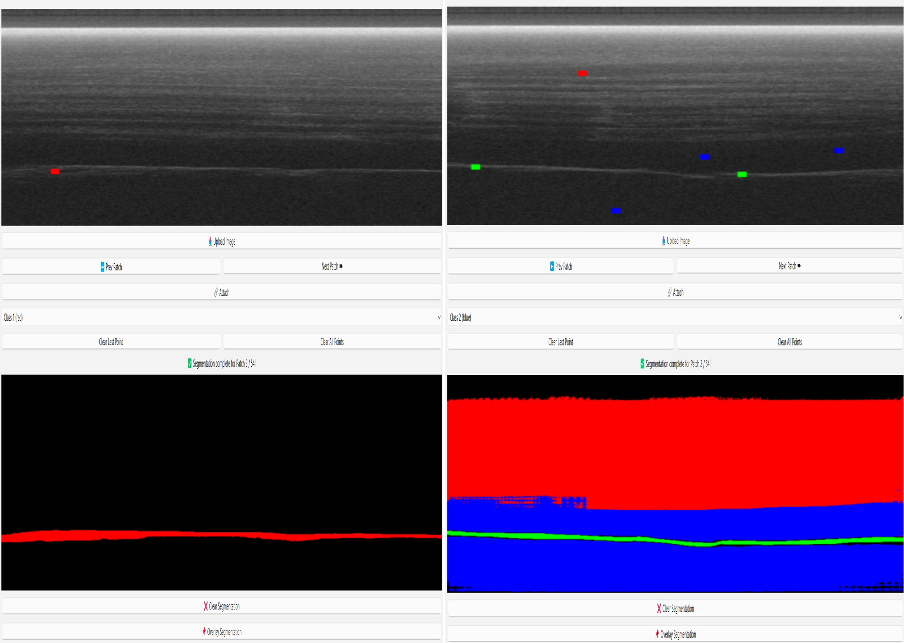

# Radargram Segmentation GUI using Segment Anything Model (SAM)

This is a graphical user interface (GUI) for visualizing and segmenting radargrams using Meta AI’s Segment Anything Model (SAM). It enables researchers and practitioners to perform point-based interactive segmentation for glaciology, subsurface analysis, and more.

---

## 🔍 Features

- 📂 Upload radargram images  
- 🔗 Attach the Segment Anything Model (SAM) backbone (e.g., ViT-H)  
- 🖱️ Select point-based prompts (foreground/background)  
- ✂️ Automatically segment subsurface features (e.g., bedrock, layers)  
- ✅ Supports multi-class segmentation  
- 🔄 Overlay segmentation mask on original radargram  
- 💾 Export segmentation masks (optional)  

---

## 🚀 Getting Started

### 1. Clone the Repository

```bash
git clone https://github.com/your-username/radargram-sam-gui.git
cd radargram-sam-gui
```

### 2. Install Requirements

Make sure you have Python 3.8+ and pip installed. Then run:

```bash
pip install -r requirements.txt
```

Typical requirements:

- `torch>=1.10` (preferably with CUDA)  
- `segment-anything` (from Meta AI GitHub)  
- `opencv-python`  
- `matplotlib`  
- `PyQt5`  

> 🛠️ Optional: Use a CUDA-enabled GPU for faster segmentation performance.

---

## 🧠 Segment Anything Model

This GUI integrates [SAM (Segment Anything Model)](https://github.com/facebookresearch/segment-anything) by Meta AI, a foundation model for prompt-driven image segmentation.

> 📥 **Note:** Download the SAM checkpoint (e.g., `sam_vit_h_4b8939.pth`) from the [official SAM GitHub](https://github.com/facebookresearch/segment-anything#model-checkpoints) and place it inside the `models/` directory. Update the path in `utils/attach.py` if needed.

---

## 🖼️ How to Use

1. **Upload Radargram**: Click the “Upload Image” button and select a radargram file (e.g., `.png`, `.jpg`).  
2. **Navigate Patches**: Use “Prev Patch” and “Next Patch” to scroll through multiple image slices (if available).  
3. **Attach SAM**: Press the “Attach” button to load the SAM model.  
4. **Select Prompts**: Click on the radargram image to select points (foreground/background). Use the Class dropdown to change the target class.  
5. **Segment**: Press the "Segment" button to perform segmentation.  
6. **Visualize**: Use “Overlay Segmentation” to view results over the original image.  
7. **Clear/Reset**: Use the “Clear” buttons to remove points or segmentation masks.  

---

  
> 🎯 Screenshot below shows single-class (left) vs multi-class (right) segmentation on radargrams.

---

## 📂 Folder Structure

```
radargram-sam-gui/
├── gui.py                  # Main GUI application
├── requirements.txt        # Required Python packages
├── README.md               # Project documentation
├── images/                 # Sample radargram images and screenshots
├── models/                 # Folder for SAM model checkpoints
├── utils/                  # Utility scripts
│   ├── attach.py           # Attach the the pretrained SAM model
│   ├── clear.py            # Utility to clear canvas or reset view
│   ├── export.py           # Export segmentation results
│   ├── loadimage.py        # Load and preprocess radargram images
│   ├── lora.py             # LoRA-based model helper functions
│   ├── mouse_Events.py     # Mouse interaction handling for GUI
│   ├── overlay.py          # Overlay results and segmentation
│   ├── patch_manager.py    # Manage patches or image tiles
│   ├── segmentation.py     # Segmentation utility functions
│   ├── ui.py               # UI components or helper functions
│   ├── yes.py              # Possibly test/debug script (rename for clarity)
│   └── zoomble_view.py     # Zooming and panning functions for image view

```

---

## 📄 License

This project is licensed under the **MIT License**. See the [LICENSE](LICENSE) file for details.

---

## 🙋‍♂️ Contributions

Pull requests, issues, and feature suggestions are welcome! If you improve the GUI, add new features, or integrate other segmentation models, feel free to contribute.

---

## 📫 Contact

For questions, ideas, or collaborations, open an [issue](https://github.com/milkisa/Radargram-labelling-GUI.git/issues) or reach out directly.
